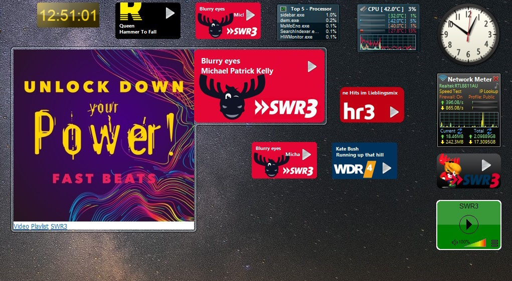

# Windows Sidebar Radio Gadgets mit Titelanzeige

Im Verzeichnis [gadgets](gadgets) sind alle Gadgets, die auf den Bildern zu sehen sind.

Die Gadgets SWR3, HR3, WDR4 und Rockland zeigen Informationen über Titel, Interpret, Playlist, Cover etc. an und beruhen auf Daten die sich über [scraper.onlineradiobox.com](https://scraper.onlineradiobox.com/de.swr3live) abfragen lassen.


Die Gadgets HR3 und WDR4 lassen sich recht einfach für andere Radiosender anpassen. Siehe [LiesMich.txt](gadgets/WDR4.gadget/LiesMich.txt).


Das Rockland Gadget ist noch recht provisorisch. Dafür lassen sich über die settings die meisten Rockland Streams auswählen, auch wenn es hier keine Infos über Titel und Cover gibt.

Nach Installieren von [DesktopGadgetsRevived-2.0.exe](programs/DesktopGadgetsRevived-2.0.exe) die Gadgets in folgendes Verzeichnis kopieren :
```java
C:\Program Files\Windows Sidebar\Gadgets
```

Weitere informationen finden sich in der Datei [LiesMich.txt](gadgets/WDR4.gadget/LiesMich.txt) im jeweiligen Gadget Verzeichnis.

Bedienung :
- Klicken auf das Play-Icon startet oder stoppt den Audio-Stream.
- Rollen der Maus auf dem Gadget verändert die Laustärke.
- Anklicken von Titel oder Interpret öffnet ein Bild des Album Covers, sofern vorhanden. Hier gibt es Links auf Video, Playlist und Homepage des Radiosenders.
- Der Button "Vergrößern" öffnet ein doppelt so großes Fenster. Praktisch bei hoch auflösenden Monitoren.
- Nur beim Rockland Gadget kann man über Button "Optionen" den Radisender auswählen.




## Zwei Gadgets für free-key-de

Die beiden Gadgets zeigen die Restzeit an, nach der man sich wieder neu anmelden muß. Doppelklicken auf die Restzeit loggt einen aus und gleich wieder ein, so daß man wieder die volle Restzeit hat.

Um den Anmeldeprozeß nachzuvollziehen wurde [LynxPortable_2.9.2.paf.exe](programs/LynxPortable_2.9.2.paf.exe) installiert. Schaltet man beim Einloggen mit Lynx über "http://hotspot.free-key-de.eu/status" mit "Ctrl + T" die Option Trace ein, dann wird der Anmeldeprozeß hier gespeichert : 

```java
C:\<Installationspfad>\LynxPortable\Data\LynxSettings\LY-TRACE.LOG
```

Hier sieht man, welche Queries mit welchen Daten gesendet bzw empfangen wurden.

Zum Debuggen wurde [Dbgview.exe](programs/Dbgview.exe) verwendet, mit dem man sich z.B. die Rückgabedaten eines XMLHttpRequest anschauen kann.

```java
System.Debug.outputString("State : " + req.readyState + " / Status : " + req.status);
System.Debug.outputString("ResponseText : " + req.responseText);
```

### FreeKey.gadget

Bedienung :
- Anklicken von Restzeit aktualisiert die Daten.
- Bei Doppelklick auf Restzeit wird man ausgeloggt und gleich wieder eingeloggt.
- Der Button "Vergrößern" öffnet ein doppelt so großes Fenster.

### FreeKey_SWR3.gadget

Dieses Gadget kombiniert die Gadgets für SWR3 und free-key.

Bedienung :
- Klicken auf das Play-Icon startet oder stoppt den Audio-Stream.
- Rollen der Maus auf dem Gadget verändert die Laustärke.
- Anklicken von Titel oder Interpret öffnet ein Bild des Album Covers, sofern vorhanden. Hier kann man auch die Status-Seite von free-key-de direkt aufrufen.
- Der Button "Vergrößern" öffnet ein doppelt so großes Fenster. 
- Anklicken von Restzeit fragt aktualisiert die Daten.
- Bei Doppelklick auf Restzeit wird man ausgeloggt und gleich wieder eingeloggt.

Ist man offline oder ist nicht über free-key im Internet, dann wird statt der Restzeit ">>SWR3" angezeigt.


