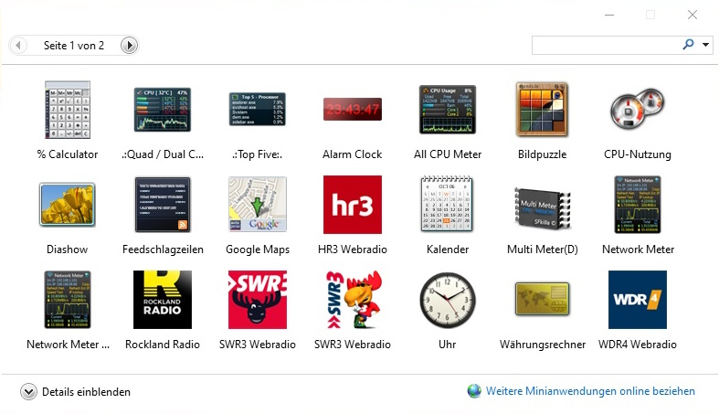

# Windows Sidebar Radio Gadgets mit Titelanzeige

Im Verzeichnis [gadgets](gadgets) sind alle Gadgets, die auf den Bildern zu sehen sind.

Die Gadgets SWR3, HR3, WDR4 und Rockland zeigen Informationen über Titel, Interpret, Playlist, Cover etc. an und beruhen auf Daten die sich über [scraper.onlineradiobox.com](https://scraper.onlineradiobox.com/de.swr3live) abfragen lassen.


Die Gadgets HR3 und WDR4 lassen sich recht einfach für andere Radiosender anpassen. Siehe [LiesMich.txt](gadgets/WDR4.gadget/LiesMich.txt).


Das Rockland Gadget ist noch recht provisorisch. Dafür lassen sich über die settings die meisten Rockland Streams auswählen, auch wenn es hier keine Infos über Titel und Cover gibt.

Nach Installieren von [DesktopGadgetsRevived-2.0.exe](programs/DesktopGadgetsRevived-2.0.exe) die Gadgets in folgendes Verzeichnis kopieren :
```java
C:\Program Files\Windows Sidebar\Gadgets
```

Weitere informationen finden sich in der Datei [LiesMich.txt](gadgets/WDR4.gadget/LiesMich.txt) im jeweiligen Gadget Verzeichnis.

Bedienung :
- Rollen der Maus auf dem Gadget verändert die Laustärke.
- Anklicken von Titel oder Interpret öffnet ein Bild des Album Covers, sofern vorhanden. Hier gibt es Links auf Video, Playlist und Homepage des Radiosenders.
- Der Button "Vergrößern" öffnet ein doppelt so großes Fenster. Praktisch bei hoch auflösenden Monitoren.
- Nur beim Rockland Gadget kann man über Button "Optionen" den Radisender auswählen.


